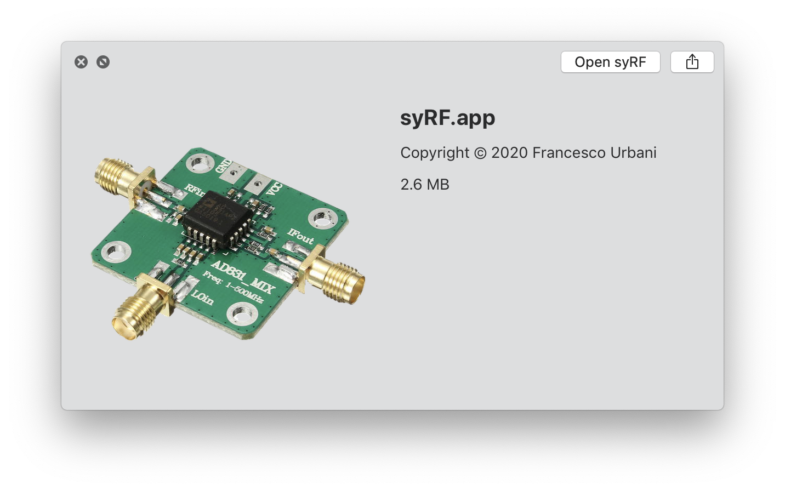
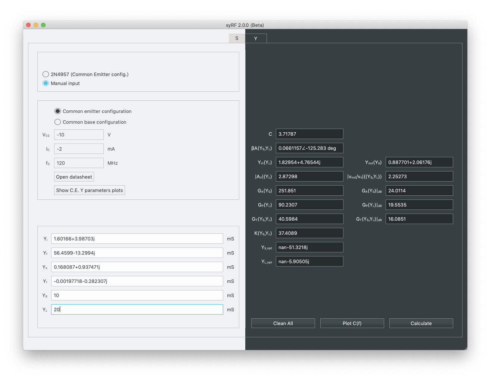

# syRF C++

CAD tool for designing RF and microwave circuits.  

Fork of [syRF](https://urbanij.github.io/syRF/) re-written from scratch in C++.

---
##### Note:
Although this compiles natively and is able to generate a stand-alone application, it does not implement <i>yet</i> every functionality that the original Python version of syRF does, such as plotting constant gain/noise circles.

