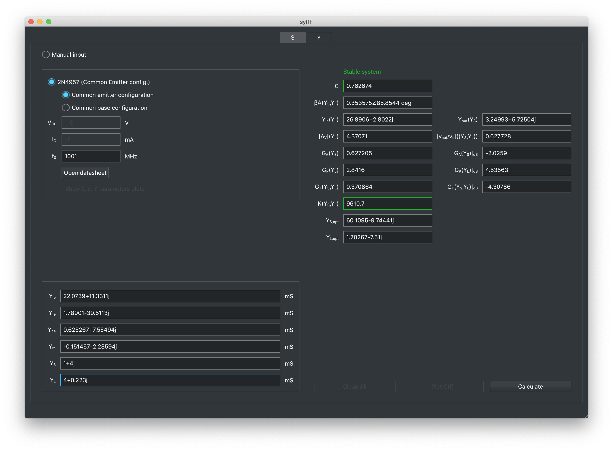

<i><a href="https://urbanij.github.io/">Francesco Urbani</a></i>

# syRF-cpp

CAD tool for designing RF and microwave circuits.  

Fork of [syRF](https://github.com/urbanij/syRF) re-written from scratch in C++.

---
##### Note:
Although this compiles natively and is able to generate a stand-alone application, it does not implement all the functionalities that [the original Python version](https://github.com/urbanij/syRF) of syRF does, such as plotting constant gain/noise circles.

